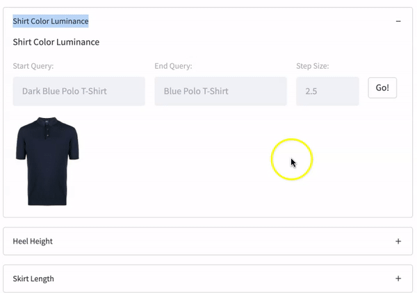

# `GradREC`

__NB: Repo is still WIP!__

## Overview

Comparative recommendations answer questions of the form "Can I have something 
_darker/longer/warmer_". Most methods require extensive labelled data and employ
learning-to-rank approaches. `GradREC` is a zero-shot approach toward generating comparative 
recommendations.  We achieve this by framing comparative recommendations as  latent 
space traversal -- a key component of our approach is leveraging the latent space learnt by 
[`FashionCLIP`](https://github.com/patrickjohncyh/fashion-clip), a CLIP-like model
fine-tuned for fashion concepts.

We postulated that like other self-supervised approaches
for learning representations ([Mikolov et al., 2012](https://aclanthology.org/N13-1090/)), the contrastive
learning approach employed by CLIP-like models should also encode certain concepts (e.g. analogies) despite
being unsupervised/self-supervised.  Of particular interest is the idea that it should be possible 
to traverse the latent space in a manner whereby we can discover products that vary along a certain 
attribute/dimension of interest (e.g. shoes of _increasing heel height_).

Our preliminary investigation of this hypothesis established that we are indeed able to extract
such comparative knowledge/concepts from CLIP-like models, allowing us to make comparative recommendations
in a zero-shot fashion.

We provide in this repo our implementation of our method, and an interactive demo that explores how
`GradREC` works.


## API & Demo

### Pre-requisites 

To access the private bucket necessary to retrieve model weights and dataset, be sure to include an `.env` 
file containing the following:

```
AWS_ACCESS_KEY_ID
AWS_SECRET_KEY
```

Critically, `GradREC` builds upon the fashion-clip package found 
[here](http://www.github.com/patrickjohncyh/fashion-clip).

### GradREC API

The `GradREC` API provides an implementation of the latent space traversal approach described in our paper.
It requires for initialization an instance of a `FashionCLIP` object (see 
fashion-clip [repo](http://www.github.com/patrickjohncyh/fashion-clip)). The API provides helper methods
for each step in our methodology such as traversal vector construction and traversal function, with the ability
to control the various parameters.

##### Usage
A `GradREC` object is initialized as follows,
```
from gradient_rec import GracREC

# we assume fclip is a FashionCLIP object 
gradrec = GradREC(fclip)
```

Several important methods are:

- `direction_vector(self, start_query: str, end_query: str, 
   start_N=100, end_N=1000)`
  - start_query: text for starting point to generate the semantic difference vector
  - end_query: text for ending point to generate the semantic difference vector
  - start_N: number of products to retrieve for start query
  - end_N: number of products to retrieve for end query

- `traverse_space(self,
                  start_point: np.ndarray,
                  search_space: np.ndarray,
                  v_dir: np.ndarray,
                  step_size: float,
                  steps: int,
                  reg_space: np.ndarray,
                  reg_weight: float,
                  reg_k: int = 100,
                  k=10)`
  
    - `start_point`: initial seed product vector or any point in space
    - `search_space`: latent representation of products to search
    - `v_dir`: traversal vector
    - `step_size`: size for each step taken
    - `steps`: number of steps to take
    - `reg_space`: latent representation of products to use for regularization
    - `reg_weight`: weight for amount of regularization to use
    - `reg_k`: number of nearest neighbors for use in regularization 
    - `k`: number of products to return for each traversal step


Please see the notebook inlcuded in this repo for a worked-out example of how
to use `GradREC`!


### GradREC Demo

The demo is built using streamlit, with further instructions and explanations included
inside.

Running the app requires access to the dataset/fine-tuned model. See below for a preview
of the demo. Stay tuned for more updates!




#### How to run
```
$ cd app
$ streamlit run app.py
```


